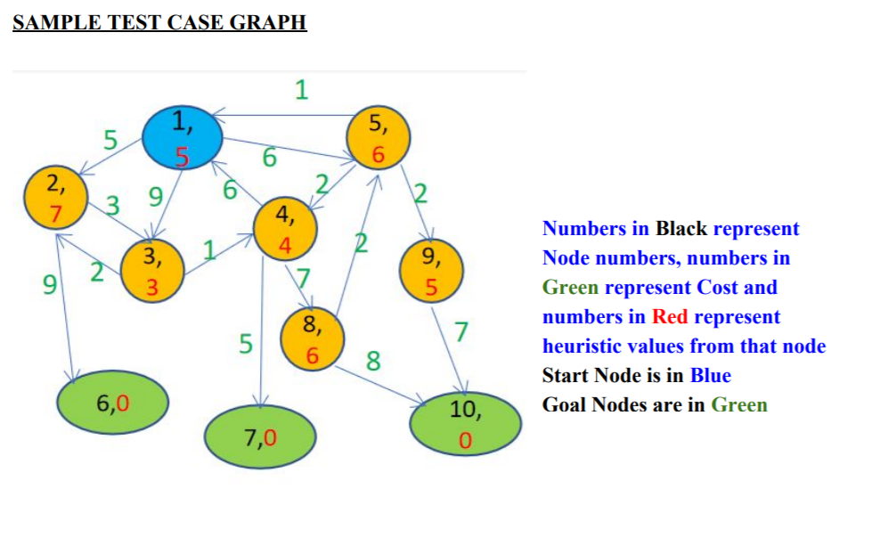

# Search Algorithms - DFS, UCS and A*
## Machine Intelligence - Assignment 2

Functions Implemented:
- ```depthFirstSearch``` : Depth-First Search
- ```uniformCostSearch``` : Uniform Cost Search
- ```astar``` : A* Search

### Run
A sample test case has been provided in order to test the functions.
    
```python3 sample_test_case.py```

Graph used as the sample test:


Implemented in Python.
